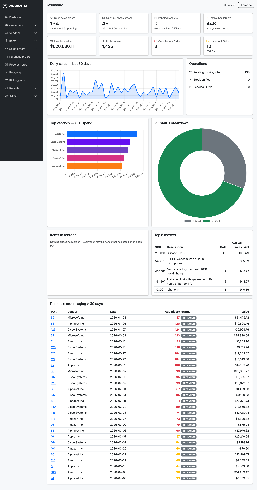
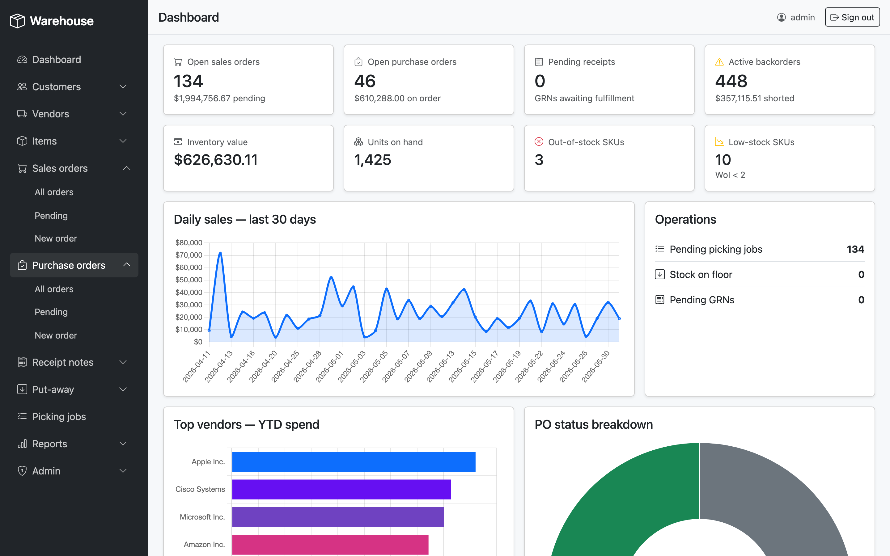
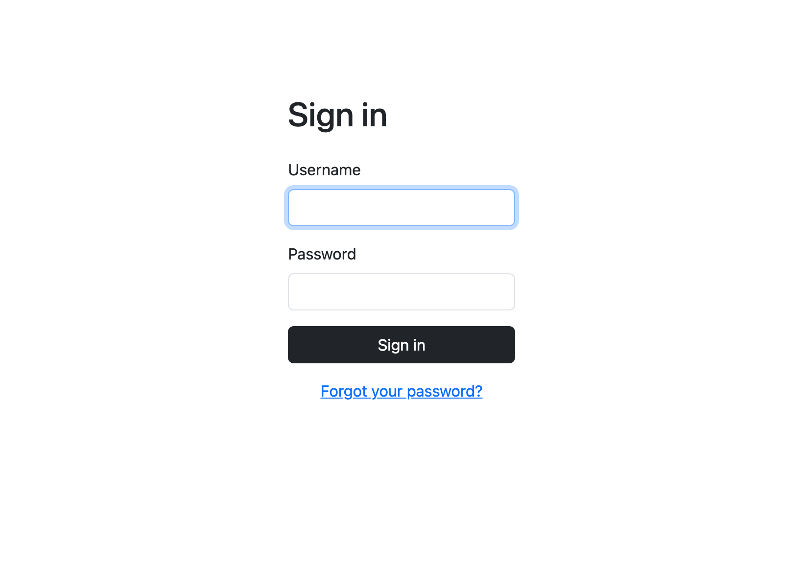
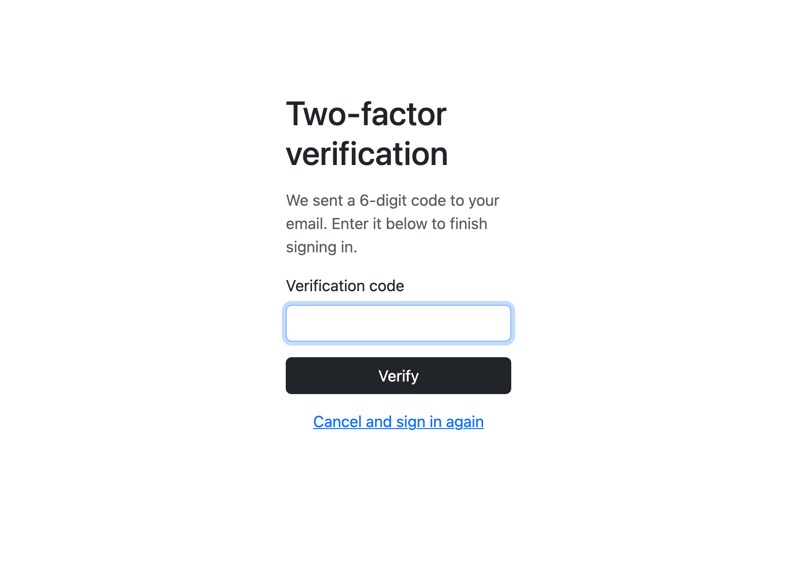
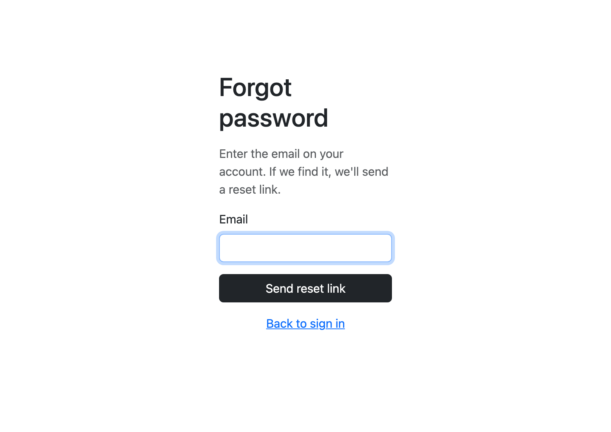
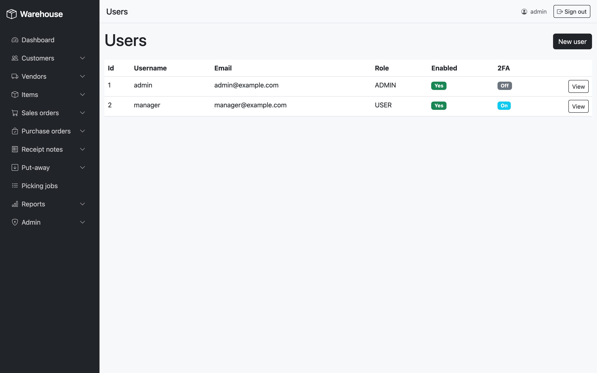

# Warehouse Management System

A self-contained Spring Boot web app for running a small-business warehouse: customers, vendors, items, sales orders, purchase orders, goods receipt notes, put-aways, picking jobs, invoices, and backorders — all gated by a real authentication layer with optional email-based two-factor auth.


---

## Highlights

- **Operational dashboard** — KPI cards (open SOs, open POs, pending GRNs, backorders) + inventory snapshot tiles (value, units, OOS, low-stock) + Chart.js daily-sales line chart, top-vendors-by-YTD-spend bar chart, and a PO-status doughnut. Two action tables surface items that need reordering and POs aging past 30 days. Top 5 movers stays.
- **Authentication built in** — Spring Security 6 form login, BCrypt password hashing, optional **email 2FA** (6-digit code per sign-in), password reset via email link, and an admin-only `/admin/users` area for user CRUD.
- **Left-sidebar UI** — dark fixed-rail navigation with Bootstrap Icons, collapsible groups for each domain area, and a Bootstrap offcanvas drawer on mobile. The topbar shows the current page title, signed-in username, and sign-out.
- **Realistic seeded data** — on first boot the app generates ~200 sales orders, ~150 purchase orders, ~1100 warehouse sections, ~400 stock rows, invoices, and backorders, all dated within the current year so dashboard charts populate immediately.
- **Tech stack** — Java 17 · Spring Boot 3.2 · Spring Security 6 · Spring Data JPA · Thymeleaf · Bootstrap 5 · Chart.js 4 · H2 (in-memory) · Lombok · Maven.

---

## Screenshots

### Landing page (dashboard)
The login lands here. KPI strip across the top, inventory snapshot, 30-day daily-sales chart, vendor spend, PO status doughnut, reorder list, top movers, and PO aging.



### Sidebar navigation
Each section expands inline. Page title and signed-in user appear in the topbar.



### Sign in
Form login at `/login`. Forgot-password link sends a reset email.



### Two-factor verification
Users with 2FA enabled are diverted to `/verify-2fa` after a correct password. A 6-digit code is generated, BCrypt-hashed, and emailed (logged to the console as a dev fallback when SMTP isn't configured).



### Forgot password
Always shows the same banner, regardless of whether the email matches an account — no enumeration.



### Admin user management
`/admin/users` — list, create, edit, enable/disable, toggle 2FA, delete. ROLE_ADMIN only.



---

## Run it

Java 17 and the bundled Maven wrapper are all you need.

```bash
./mvnw spring-boot:run
```

Then open <http://localhost:8080> and sign in with one of the seeded accounts:

| Username  | Password        | Role   | 2FA |
|-----------|-----------------|--------|-----|
| `admin`   | `Password123!`  | ADMIN  | off |
| `manager` | `Password123!`  | USER   | on  |

Signing in as `manager` triggers the 2FA flow. By default SMTP is not configured, so the 6-digit code is printed to the app log (search for `Your verification code is:`) instead of being emailed. To deliver real emails, see the next section.

### Configure email for 2FA and password reset

Outbound mail (2FA codes, password-reset links) goes through standard Spring Mail. Without credentials, `EmailService` falls back to logging the message body to the console — useful for dev, but you'll want real delivery for any other use case.

1. **Copy the env template and fill in your SMTP details.** A `.env.example` ships at the project root; copy it to `.env` (already gitignored) and edit:
   ```bash
   cp .env.example .env
   ```
   ```bash
   # .env
   MAIL_HOST=smtp.gmail.com
   MAIL_PORT=587
   MAIL_USERNAME=you@gmail.com
   MAIL_PASSWORD=your-app-password
   MAIL_FROM=no-reply@yourdomain.com
   APP_BASE_URL=http://localhost:8080
   ```
   For Gmail, `MAIL_PASSWORD` must be an [App Password](https://support.google.com/accounts/answer/185833), not your account password.

2. **Source the file before launching.** Spring Boot doesn't auto-load `.env`; you have to export the values into the shell first:
   ```bash
   set -a; source .env; set +a
   ./mvnw spring-boot:run
   ```
   `set -a` makes every variable that `source` introduces visible to child processes; `set +a` turns that behavior off after. The Maven plugin then forwards them to the Spring Boot JVM, where `application.properties` picks them up via `${MAIL_HOST}` etc.

3. **Point the `manager` account at a real inbox.** The seeded address `manager@example.com` doesn't go anywhere. Log in as `admin / Password123!` → **Users** (`/admin/users`) → click `manager` → **Update** → set Email → save. The next 2FA login as `manager` will deliver the code to that address.

   If you'd rather skip the UI, run this against the H2 console (<http://localhost:8080/h2-console>):
   ```sql
   UPDATE app_user SET email = 'you@yourdomain.com' WHERE username = 'manager';
   ```

**Alternatives to the sourced `.env` flow**, in case it doesn't fit your setup:

- **IntelliJ / VS Code run configuration** — paste the variables into the Run Configuration's "Environment variables" field. No `.env` file on disk.
- **`src/main/resources/application-local.properties` + `--spring.profiles.active=local`** — Spring-native. Values live in the source tree; gitignore the file.
- **[`spring-dotenv`](https://github.com/paulschwarz/spring-dotenv)** — one Maven dependency makes Spring auto-load `.env` from the project root. Worth it if you do this often.

### Useful commands

```bash
./mvnw spring-boot:run                                # run on :8080
./mvnw clean package                                  # build the jar
./mvnw test                                           # run tests
./mvnw -Dtest=TrieTest test                           # run one test class
./mvnw -Dtest=TrieTest#getWordList test               # run one test method
```

The H2 console is exposed at <http://localhost:8080/h2-console> (JDBC URL `jdbc:h2:mem:testdb`, user `SA`, no password) for ad-hoc SQL against the running database.

---

## Core domain workflow

Inbound and outbound flows share a small entity vocabulary:

1. **Purchase order** → on receipt, a **goods receipt note (GRN)** is opened against it.
2. Fulfilling the GRN creates **stock** rows on a floor section (`00-00-0-0`).
3. **Put-away** moves stock from the floor to a real warehouse section.
4. Saving a **sales order** also creates a **picking job** that mirrors each order line.
5. Fulfilling the picking job decrements stock, writes an **invoice**, and creates **backorders** for unmet quantities.

The dashboard queries surface every link in that chain.

---

## Project layout

```
src/main/java/com/example/warehouseManagement/
├── Bootstrap/           # CommandLineRunner that seeds the in-memory DB
├── Controllers/         # Spring MVC controllers (Thymeleaf views)
├── Domains/             # JPA entities + nested status enums
│   ├── DTOs/            # Projection DTOs returned by native queries
│   └── Exceptions/      # Domain exceptions caught by controllers
├── Repositories/        # Spring Data CrudRepository interfaces (many native @Query)
├── Security/            # SecurityConfig + 2FA AuthenticationSuccessHandler
├── Services/            # Interface + Impl per capability
├── Util/                # Small standalone helpers
└── DSA/                 # Trie + BinarySearchTree (used by tests)

src/main/resources/
├── application.properties
└── templates/
    ├── admin/           # User CRUD pages (ROLE_ADMIN)
    ├── auth/            # Login, verify-2fa, forgot/reset password
    ├── customers/       # Customer CRUD
    ├── dashboard/       # Operational dashboard
    ├── fragments/       # Shared header/navbar/footer fragments
    ├── goodsReceiptNotes/ items/ itemPrices/
    ├── pickingJobs/ purchaseOrders/ putAwayTasks/
    ├── reports/ salesOrders/ vendors/
```

---

## Gotchas

- **In-memory database.** Every restart wipes the DB and `Bootstrap` re-seeds. Persistent storage is on the roadmap (file-based H2 + Flyway migrations).
- **H2-specific SQL.** Native queries use H2 dialect (`TO_CHAR`, `DATEDIFF('DAY', …)`, `EXTRACT(WEEK FROM CURRENT_DATE())`, `NVL`). Swapping databases will require rewriting the report and dashboard queries.
- **Default seed credentials are dev-only.** Change them or wipe the seed before exposing the app outside localhost.

---

## License

MIT.
